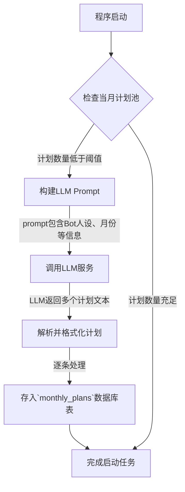
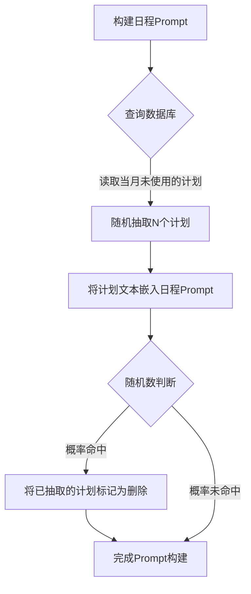

# “月层计划”系统架构设计文档

## 1. 系统概述与目标

本系统旨在为Bot引入一个动态的、由大型语言模型（LLM）驱动的“月层计划”机制。其核心目标是取代静态、预设的任务模板，转而利用LLM在程序启动时自动生成符合Bot人设的、具有时效性的月度计划。这些计划将被存储、管理，并在构建每日日程时被动态抽取和使用，从而极大地丰富日程内容的个性和多样性。

---

## 2. 核心设计原则

- **动态性与智能化:** 所有计划内容均由LLM实时生成，确保其独特性和创造性。
- **人设一致性:** 计划的生成将严格围绕Bot的核心人设进行，强化角色形象。
- **持久化与可管理:** 生成的计划将被存入专用数据库表，便于管理和追溯。
- **消耗性与随机性:** 计划在使用后有一定几率被消耗（删除），模拟真实世界中计划的完成与迭代。

---

## 3. 系统核心流程规划

本系统包含两大核心流程：**启动时的计划生成流程**和**日程构建时的计划使用流程**。

### 3.1 流程一：启动时计划生成

此流程在每次程序启动时触发，负责填充当月的计划池。



### 3.2 流程二：日程构建时计划使用

此流程在构建每日日程的提示词（Prompt）时触发。



---

## 4. 数据库模型设计

为支撑本系统，需要新增一个数据库表。

**表名:** `monthly_plans`

| 字段名 | 类型 | 描述 |
| :--- | :--- | :--- |
| `id` | Integer | 主键，自增。 |
| `plan_text` | Text | 由LLM生成的计划内容原文。 |
| `target_month` | String(7) | 计划所属的月份，格式为 "YYYY-MM"。 |
| `is_deleted` | Boolean | 软删除标记，默认为 `false`。 |
| `created_at` | DateTime | 记录创建时间。 |

---

## 5. 详细模块规划

### 5.1 LLM Prompt生成模块

- **职责:** 构建高质量的Prompt以引导LLM生成符合要求的计划。
- **输入:** Bot人设描述、当前月份、期望生成的计划数量。
- **输出:** 一个结构化的Prompt字符串。
- **Prompt示例:**
  ```
  你是一个[此处填入Bot人设描述，例如：活泼开朗、偶尔有些小迷糊的虚拟助手]。
  请为即将到来的[YYYY年MM月]设计[N]个符合你身份的月度计划或目标。
  
  要求：
  1. 每个计划都是独立的、积极向上的。
  2. 语言风格要自然、口语化，符合你的性格。
  3. 每个计划用一句话或两句话简短描述。
  4. 以JSON格式返回，格式为：{"plans": ["计划一", "计划二", ...]}
  ```

### 5.2 数据库交互模块

- **职责:** 提供对 `monthly_plans` 表的增、删、改、查接口。
- **规划函数列表:**
  - `add_new_plans(plans: list[str], month: str)`: 批量添加新生成的计划。
  - `get_active_plans_for_month(month: str) -> list`: 获取指定月份所有未被删除的计划。
  - `soft_delete_plans(plan_ids: list[int])`: 将指定ID的计划标记为软删除。

### 5.3 配置项规划

需要在主配置文件 `config/bot_config.toml` 中添加以下配置项，以控制系统行为。

```toml
# ----------------------------------------------------------------
# 月层计划系统设置 (Monthly Plan System Settings)
# ----------------------------------------------------------------
[monthly_plan_system]

# 是否启用本功能
enable = true

# 启动时，如果当月计划少于此数量，则触发LLM生成
generation_threshold = 10

# 每次调用LLM期望生成的计划数量
plans_per_generation = 5

# 计划被使用后，被删除的概率 (0.0 到 1.0)
deletion_probability_on_use = 0.5
```

---
**文档结束。** 本文档纯粹为架构规划，旨在提供清晰的设计思路和开发指引，不包含任何实现代码。